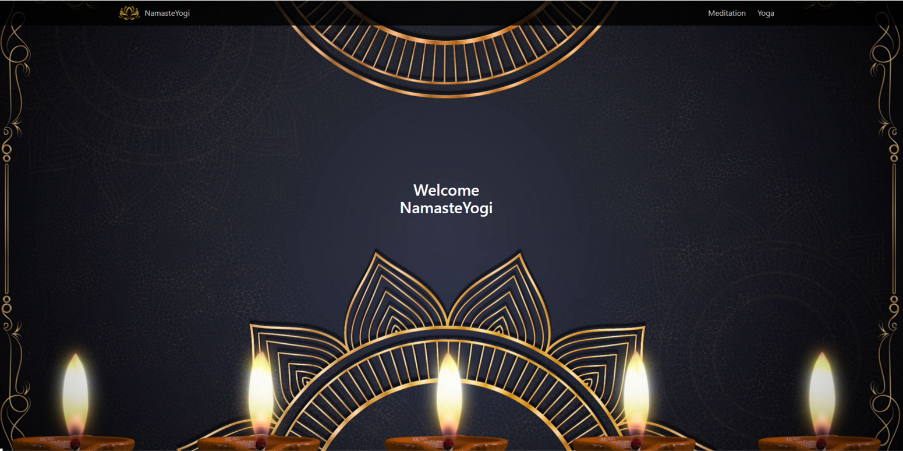

# Description
Are you busy, stressed...maybe you're just looking for a few zen moments?  NamasteYogi, we see you.  With this app, you can cultivate a yoga and meditation practice all on your own.  Choose the type of zen you need today - yoga or meditation.  Choose yoga from the home menu to search for poses to practice and even save the poses you like!  If you prefer to practice in studio, enter your zip code in the applicable search box and get your practice on!  If you crave stillness and healing vibrations, choose meditation and enjoy the healing vibes of our musical offering.  

	* Application uses at least two server-side APIs.

    * Application uses client-side storage to store persistent data.

    * Application doesn't use JS alerts, prompts, or confirms (Would use modals if needed).

    * Application uses a CSS framework other than Bootstrap.

    * Application is interactive (accepts and responds to user input)

# Technologies Used
	* Application uses two server-side APIs - Yelp and youTube.
    * Application uses client-side storage to store persistent data.
    * HTML, JavaScript, jQuery, CSS, BULMA CSS framework
    * Application is interactive (accepts and responds to user input of poses and zip code)

# Deployment
Deployed Site - https://descoding.github.io/NamasteYogi2.0/

GitHub Repo - https://github.com/DesCoding/NamasteYogi2.0

# Demo

# MIT License

Copyright (c) 2021 DesCoding

Permission is hereby granted, free of charge, to any person obtaining a copy
of this software and associated documentation files (the "Software"), to deal
in the Software without restriction, including without limitation the rights
to use, copy, modify, merge, publish, distribute, sublicense, and/or sell
copies of the Software, and to permit persons to whom the Software is
furnished to do so, subject to the following conditions:

The above copyright notice and this permission notice shall be included in all
copies or substantial portions of the Software.

THE SOFTWARE IS PROVIDED "AS IS", WITHOUT WARRANTY OF ANY KIND, EXPRESS OR
IMPLIED, INCLUDING BUT NOT LIMITED TO THE WARRANTIES OF MERCHANTABILITY,
FITNESS FOR A PARTICULAR PURPOSE AND NONINFRINGEMENT. IN NO EVENT SHALL THE
AUTHORS OR COPYRIGHT HOLDERS BE LIABLE FOR ANY CLAIM, DAMAGES OR OTHER
LIABILITY, WHETHER IN AN ACTION OF CONTRACT, TORT OR OTHERWISE, ARISING FROM,
OUT OF OR IN CONNECTION WITH THE SOFTWARE OR THE USE OR OTHER DEALINGS IN THE
SOFTWARE.

# Contact Info
NamasteYogi was a collaborative project, created by Tera Brown, Latuanja Carson, Jessica Ferguson, and Desiree Stout.  To contact us, e-mail d.stout31@yahoo.com
